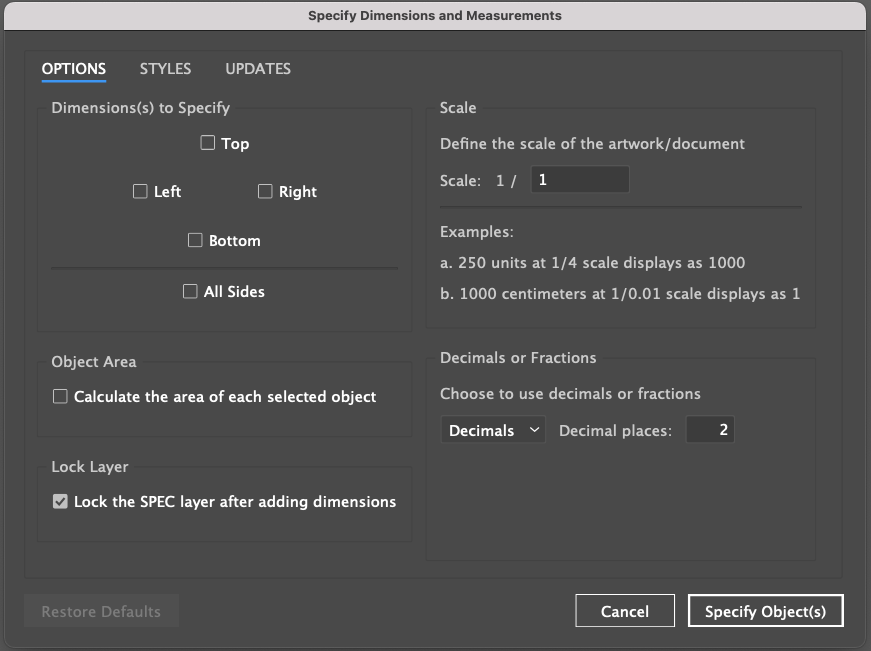
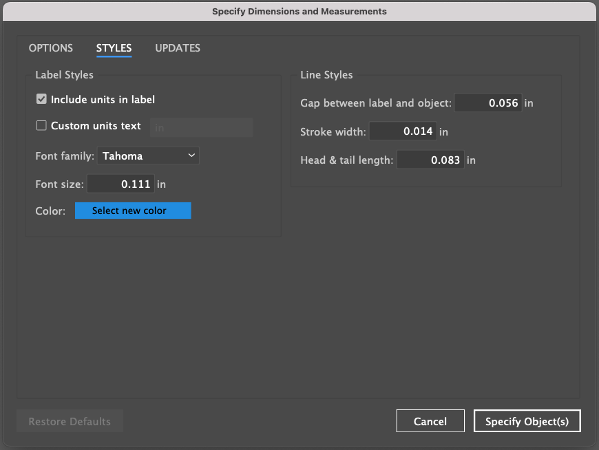

# Specify: A dimensioning extension for Adobe Illustrator

Adobe Illustrator extension to automate specifying dimension measurements (and adding dimension lines) of single or multiple objects, and specifying the dimensions between two objects.

- [Specify Homepage](https://specify.dehaven.org)
- [Install Specify from Adobe Creative Cloud](https://exchange.adobe.com/creativecloud.details.106345.html)

## Installation

### Extension Install

Simply [download the Specify extension from Adobe Exchange](https://exchange.adobe.com/creativecloud.details.106345.html).

## Usage

To run the extension, first select one or more objects in your open Illustrator document. You must have at least one object selected via Illustrator's Selection Tool <kbd>V</kbd> or Direct Selection Tool <kbd>A</kbd>.

After [installing the Specify extension from Adobe Exchange](https://exchange.adobe.com/creativecloud.details.106345.html), simply navigate to `Window > Extensions > Specify` to get started. Run the extension by simply clicking the "Specify Object(s)" button in the extension panel.

> **NOTE**: If you receive an error that the extension is not compatible with your installed version of Adobe Illustrator, or if the extension becomes incompatible after an Adobe update, navigate to "Manage Plugins" within the Creative Cloud desktop application. Uninstall the Specify extension, and then simply re-install the extension.

### Options and Styles

When the extension initializes, you will be presented with a dialog that allows you to choose which dimension(s) of your object(s) you would like to specify. The dialog also allows for the customization of several options.

Any changes to the settings defined in the Specify Dialog (including both the [Options Panel](#options-panel) and the [Styles Panel](#styles-panel)) will persist even after closing the Adobe Illustrator application (version `3.2.0` and newer).

After configuring your desired settings, make sure to select which dimension(s) to dimension, and then simply click the "Specify Object(s)" button at the bottom right of the dialog. Specify will quickly output all selected dimensions onto a new **SPEC** layer, and then lock the layer to prevent accidental edits.

### SPEC Layer

You are free to unlock the **SPEC** layer and edit as needed. You may change the color of individual dimension labels, adjust the placement of dimension groups, or even remove dimensions you no longer need.

If you make a mistake, no problem! Simply select the desired objects and run the extension again.

## Options Panel

The Options Panel allows the user to select the side(s) of the object(s) to dimension, whether to dimension the object itself or between objects, and the scale of the artwork.

### Dimensions

The options panel allows you to first choose which dimension(s) of your Illustrator object you would like to specify. You may choose top, right, bottom, left, or any combination of sides.

### Multiple Objects

If exactly two objects are selected on your artboard, you will be given the option to dimension between the two objects, instead of their individual sides. When checked, this option will specify the selected dimension(s) between the two chosen objects.

### Scale

You may define a custom scale for your artwork, which will apply a multiplier to the displayed units label.

For example, if you are designing an engineering drawing at 1/4 scale (or 1:4), you simply choose this ratio from the **Scale** dropdown menu, and then optionally enable the checkbox for [Custom Units Text](#custom-units-text) on the Styles Panel that corresponds to the unit labels you would like to output. In this example, choosing '1/4' will indicate the artwork is drawn at one-fourth scale, resulting in dimension values that are 4 times their drawn dimensions.

## Styles Panel

The Styles Panel allows the user to completely customize the label styles and the line styles for all dimensions.

### Include Units in Label

When checked, inserts the units in the label alongside the dimension measurement.

The extension automatically dimensions objects based on the Document's default units. To dimension in different units (i.e. Inches, Centimeters, etc.), first, select show Rulers via `View > Rulers > Show Rulers` ( <kbd>⌘Cmd</kbd> + <kbd>R</kbd> on Mac, <kbd>Ctrl</kbd> + <kbd>R</kbd> on PC ).

Next, right-click on the Ruler, and select your desired units. Otherwise, the extension will use the Document's selected units by default.

### Custom Units Text

When checked, allows the user to customize the text of the units label. For example, displaying the abbreviation for feet, "ft" instead of the ruler measurement unit.

### Decimals

Set the desired number of decimal places to display after the decimal point in the label dimensions.

### Font Family

Set the desired font family for the dimension label(s). Default is &quot;Tahoma&quot;.

### Font Size

Set the desired font size for the dimension label(s). If the value is less than one (e.g. 0.25) you must include a leading zero before the decimal point.

### Color

Click to select the color for the dimension label(s).

### Gap

Set the size of the desired gap between the dimension label(s) and the object.

### Stroke Width

Set the desired stroke width of the dimension line.

### Head & Tail Length

Set the desired length of the line at both ends of the dimension line.

## Reset

At the bottom left of the Specify dialog is a Reset button that restores all defaults in both the Options Panel and the Styles panel.

## Support

Do you have questions? Would you like to contribute? Something else? Feel free to [open an issue on GitHub](https://github.com/adamdehaven/specify/issues).

Not into looking at code? No worries. Reach out on Twitter [@adamdehaven](https://twitter.com/adamdehaven).

## Examples

